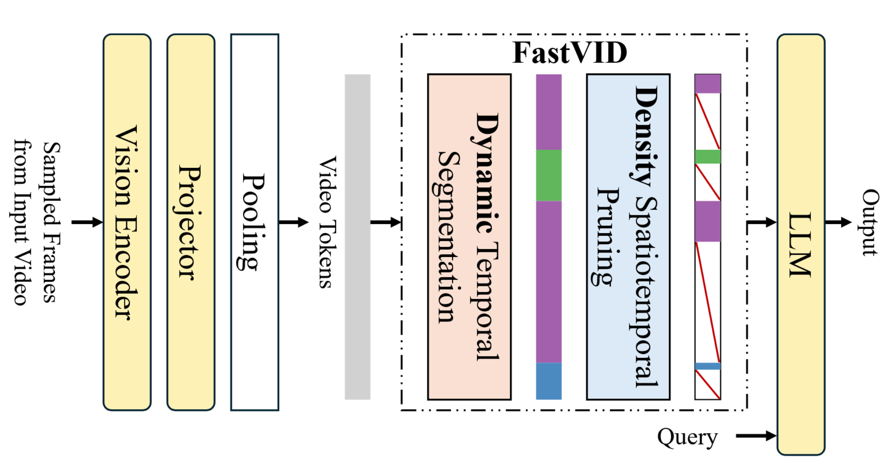

# MLLMs-Acceleration

Here, I implement some recent state-of-the-art works on Multimodal Large Language Models(MLLMs) inference acceleration. The code is well-organized and readable. 

**Note**: All the implementation are based on the official implementation.

Todo List:
- [x] Debug FastVID Implementation.
- [x] Debug VisionZip implementation.
- [ ] Align PruneVid with official implementation.
- [ ] Implement more SoTA methods.
- [ ] Support more MLLMs.
- [ ] Support more methods' evaluation using lmms-eval.

## 🔨Installation

First, clone this repository.

```
git clone https://github.com/Fanziyang-v/MLLMs-Accelerator.git
cd MLLMs-Accelerator
```

Second, create a virtual environment by conda.

```
conda create -n mllm_accelerator python=3.10 -y
conda activate mllm_accelerator
```

Third, install the dependencies.

```
pip install -e .
pip install -e lmms-eval
pip install transformers==4.51.3
```


## 🧰Implementation

### FastV (ECCV 2024 Oral)

**Authors**: *Liang Chen, Haozhe Zhao, Tianyu Liu, Shuai Bai, Junyang Lin, Chang Zhou, Baobao Chang*

**Abstract**: In this study, we identify the inefficient attention phenomena in Large Vision-Language Models (LVLMs), notably within prominent models like LLaVA-1.5, QwenVL-Chat and Video-LLaVA. We find out that the attention computation over visual tokens is of extreme inefficiency in the deep layers of popular LVLMs, suggesting a need for a sparser approach compared to textual data handling. To this end, we introduce FastV, a versatile plug-and-play method designed to optimize computational efficiency by learning adaptive attention patterns in early layers and pruning visual tokens in subsequent ones. Our evaluations demonstrate FastV's ability to dramatically reduce computational costs (e.g., a 45 reduction in FLOPs for LLaVA-1.5-13B) without sacrificing performance in a wide range of image and video understanding tasks. The computational efficiency and performance trade-off of FastV are highly customizable and pareto-efficient. It can compress the FLOPs of a 13B-parameter model to achieve a lower budget than that of a 7B-parameter model, while still maintaining superior performance. We believe FastV has practical values for deployment of LVLMs in edge devices and commercial models. Code is released at [github.com/pkunlpicler/FastV](https://github.com/pkunlpicler/FastV).


### FasterVLM


**Authors**: *Qizhe Zhang, Aosong Cheng, Ming Lu, Renrui Zhang, Zhiyong Zhuo, Jiajun Cao, Shaobo Guo, Qi She, Shanghang Zhang*

**Abstract**: Large vision-language models (VLMs) often rely on a substantial number of visual tokens when interacting with large language models (LLMs), which has proven to be inefficient. Recent efforts have aimed to accelerate VLM inference by pruning visual tokens. Most existing methods assess the importance of visual tokens based on the text-visual cross-attentions in LLMs. In this study, we find that the crossattentions between text and visual tokens in LLMs are inaccurate. Pruning tokens based on these inaccurate attentions leads to significant performance degradation, especially at high reduction ratios. To this end, we introduce FasterVLM, a simple yet effective training-free visual token pruning method that evaluates the importance of visual tokens more accurately by utilizing attentions between the [CLS] token and image tokens from the visual encoder. Since FasterVLM eliminates redundant visual tokens immediately after the visual encoder, ensuring they do not interact with LLMs and resulting in faster VLM inference. It is worth noting that, benefiting from the accuracy of [CLS] cross-attentions, FasterVLM can prune 95% of visual tokens while maintaining 90% of the performance of LLaVA-1.5-7B. We apply FasterVLM to various VLMs, including LLaVA-1.5, LLaVA-NeXT, and Video-LLaVA, to demonstrate its effectiveness. Experimental results show that our FasterVLM maintains strong performance across various VLM architectures and reduction ratios, significantly outperforming existing text-visual attention-based methods. Our code is available at [https://github.com/Theia-4869/FasterVLM](https://github.com/Theia-4869/FasterVLM).


### VisionZip (CVPR 2025)

**Authors**: *Senqiao Yang, Yukang Chen, Zhuotao Tian, Chengyao Wang, Jingyao Li, Bei Yu, Jiaya Jia*

**Abstract**: Recent advancements in vision-language models have enhanced performance by increasing the length of visual tokens, making them much longer than text tokens and significantly raising computational costs. However, we observe that the visual tokens generated by popular vision encoders, such as CLIP and SigLIP, contain significant redundancy. To address this, we introduce VisionZip, a simple yet effective method that selects a set of informative tokens for input to the language model, reducing visual token redundancy and improving efficiency while maintaining model performance. The proposed VisionZip can be widely applied to image and video understanding tasks and is well-suited for multi-turn dialogues in real-world scenarios, where previous methods tend to underperform. Experimental results show that VisionZip outperforms the previous state-of-theart method by at least 5% performance gains across nearly all settings. Moreover, our method significantly enhances model inference speed, improving the prefilling time by 8× and enabling the LLaVA-Next 13B model to infer faster than the LLaVA-Next 7B model while achieving better results. Furthermore, we analyze the causes of this redundancy and encourage the community to focus on extracting better visual features rather than merely increasing token length. Our code is available at [https://github.com/dvlab-research/VisionZip](https://github.com/dvlab-research/VisionZip).


### DyCoke (CVPR 2025)

**Authors**: *Keda Tao, Can Qin, Haoxuan You, Yang Sui, Huan Wang*

**Abstract**: Video large language models (VLLMs) have significantly advanced recently in processing complex video content, yet their inference efficiency remains constrained because of the high computational cost stemming from the thousands of visual tokens generated from the video inputs. We empirically observe that, unlike single image inputs, VLLMs typically attend visual tokens from different frames at different decoding iterations, making a one-shot pruning strategy prone to removing important tokens by mistake. Motivated by this, we present DyCoke, a training-free token compression method to optimize token representation and accelerate VLLMs. DyCoke incorporates a plug-and-play temporal compression module to minimize temporal redundancy by merging redundant tokens across frames, and applies dynamic KV cache reduction to prune spatially redundant tokens selectively. It ensures high-quality inference by dynamically retaining the critical tokens at each decoding step. Extensive experimental results demonstrate that DyCoke can outperform the prior SoTA counterparts, achieving 1.5X inference speedup, 1.4X memory reduction against the baseline VLLM, while still improving the performance, with no training.


### PruneVid (ACL 2025)

**Authors**: *Xiaohu Huang, Hao Zhou, Kai Han*

**Abstract**: In this paper, we introduce PruneVid, a visual token pruning method designed to enhance the efficiency of multi-modal video understanding. Large Language Models (LLMs) have shown promising performance in video tasks due to their extended capabilities in comprehending visual modalities. However, the substantial redundancy in video data presents significant computational challenges for LLMs. To address this issue, we introduce a training-free method that 1) minimizes video redundancy by merging spatial-temporal tokens, and 2) leverages LLMs' reasoning capabilities to selectively prune visual features relevant to question tokens, enhancing model efficiency. We validate our method across multiple video benchmarks, which demonstrate that PruneVid can prune over 80% of tokens while maintaining competitive performance combined with different model networks. This highlights its superior effectiveness and efficiency compared to existing pruning methods. Code: [https://github.com/Visual-AI/PruneVid](https://github.com/Visual-AI/PruneVid).


### FastVID

**Authors**: *Leqi Shen, Guoqiang Gong, Tao He, Yifeng Zhang, Pengzhang Liu, Sicheng Zhao, Guiguang Ding*

**Abstract**: Video Large Language Models have demonstrated strong video understanding capabilities, yet their practical deployment is hindered by substantial inference costs caused by redundant video tokens. Existing pruning techniques fail to fully exploit the spatiotemporal redundancy inherent in video data. To bridge this gap, we perform a systematic analysis of video redundancy from two perspectives: temporal context and visual context. Leveraging these insights, we propose Dynamic Density Pruning for Fast Video LLMs termed FastVID. Specifically, FastVID dynamically partitions videos into temporally ordered segments to preserve temporal structure and applies a density-based token pruning strategy to maintain essential visual information. Our method significantly reduces computational overhead while maintaining temporal and visual integrity. Extensive evaluations show that FastVID achieves state-of-the-art performance across various short- and long-video benchmarks on leading Video LLMs, including LLaVA-OneVision and LLaVAVideo. Notably, on LLaVA-OneVision-7B, FastVID effectively prunes 90.3% of video tokens, reduces FLOPs to 8.3%, and accelerates the prefilling stage by 7.1×, while maintaining 98.0% of the original accuracy. The code is available at [https://github.com/LunarShen/FastVID](https://github.com/LunarShen/FastVID).




## ⭐Acknowledgement

The codes are built upon the [LLaVA-NEXT](https://github.com/LLaVA-VL/LLaVA-NeXT) and [lmms-eval](https://github.com/EvolvingLMMs-Lab/lmms-eval) codebase. Besides, all the MLLMs acceleration methods are implemented based on the official implementations of [VisionZip](https://github.com/dvlab-research/VisionZip), [FastV](https://github.com/pkunlp-icler/FastV), [FasterVLM](https://github.com/Theia-4869/FasterVLM), [FastVID](https://github.com/LunarShen/FastVID), [PruneVID](https://github.com/Visual-AI/PruneVid) and [DyCoke](https://github.com/KD-TAO/DyCoke). Thanks for their excellent works!
